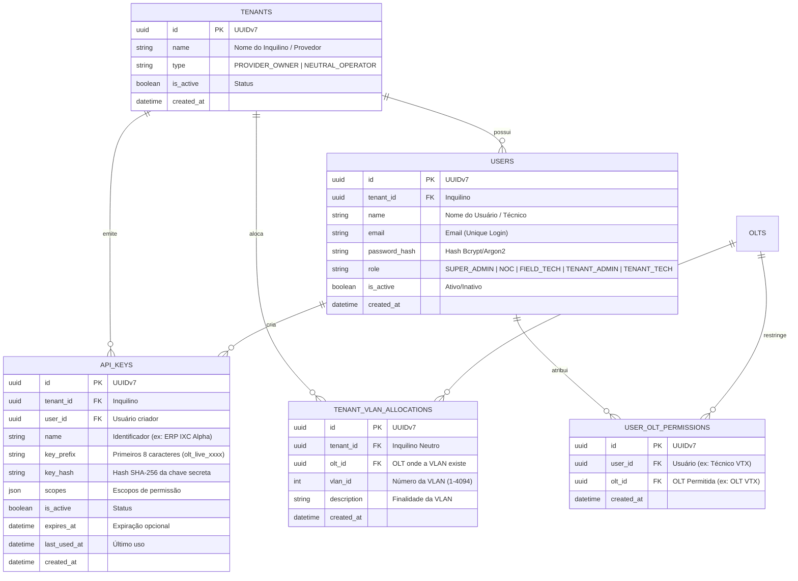

# Brainstorming: Arquitetura de Autenticação RBAC, Multi-Tenancy & Rede Neutra (v1)

**Data:** 12/09/2026  
**Status:** Em Debate & Alinhamento de Requisitos  
**Autor:** Antigravity AI & Ruy

---

## 1. Contexto e Motivação

Atualmente, a `oltapi` utiliza uma única chave de autenticação estática via cabeçalho `X-API-Key` definida no arquivo `.env`. Essa abordagem atendeu perfeitamente ao estágio inicial de desenvolvimento dos drivers e validação de hardware de bancada.

Entretanto, para avançar para a **Opção 3 (Interface Web / Dashboard de Bancada)** e permitir o uso seguro em ambientes de produção reais com múltiplos agentes, faz-se estritamente necessária uma evolução no controle de acesso:

1. **Equipes Técnicas do Provedor (Segmentação Geográfica/POP):**
   - Técnico de **VTX** só deve visualizar e provisionar na OLT de **VTX**.
   - Técnico de **Altamira** só deve provisionar na OLT de **Altamira**.
   - Equipe de **NOC** e ERP corporativo do provedor possuem acesso irrestrito a todas as OLTs e operações.

2. **Clientes de Rede Neutra (Multi-Tenant & Isolamento L2/VLAN):**
   - O parceiro de rede neutra recebe um login/senha para a futura interface Web.
   - Na Web, ele pode visualizar o status de suas ONUs e **gerar suas próprias chaves de API** para integrar ao seu ERP (ex: IXC, MK-Auth, SGP, Voalle).
   - O ERP do parceiro neutro **só pode provisionar em sua(s) VLAN(s) contratada(s)** e nas OLTs onde ele possui alocação.
   - **Blindagem Absoluta:** O parceiro neutro jamais pode enxergar dados, tráfego, seriais ou VLANs de outros parceiros ou do provedor dono da infraestrutura.

3. **Chave Mestra de Emergência (Super Admin):**
   - Manutenção da chave `API_KEY` do `.env` como chave mestra imutável para acesso administrativo irrestrito, recuperação de desastres e bypass de emergência.

---

## 2. Análise de Segurança em Primeiro Lugar

> **Pergunta de Segurança:** A mudança proposta aumenta ou diminui a segurança?
>
> **Resposta Técnica:** **Aumenta drasticamente a segurança.**
> - **Redução da Superfície de Ataque:** Elimina o vazamento catastrófico de uma chave mestra única compartilhada com técnicos ou terceiros.
> - **Princípio do Menor Privilégio (PoLP):** Cada técnico ou ERP só possui permissão para agir dentro do seu POP (OLT) e na sua respectiva VLAN.
> - **Auditoria e Rastreabilidade:** Cada operação (provisionamento, suspensão, reinicialização) passa a ser vinculada ao `user_id` ou `api_key_id` que a executou, gerando logs de auditoria imutáveis.
> - **Revogação Instantânea:** Se um técnico for desligado ou uma API Key de ERP vazar, ela pode ser revogada imediatamente no banco sem parar o restante da operação.

---

## 3. Modelo de Dados Proposto (SQLAlchemy 2.0 / PostgreSQL)

Todas as entidades utilizarão estritamente **UUIDv7** para identificadores únicos ordenados temporalmente.



---

## 4. Matriz de Perfis e Permissões (RBAC)

| Papel (Role) | Tipo de Organização | Acesso OLTs | Acesso VLANs | Acesso Web UI | Permissões de API |
| :--- | :--- | :--- | :--- | :--- | :--- |
| **SUPER_ADMIN** | Provedor Dono | Todas (Irrestrito) | Todas (1-4094) | Acesso Total + Gestão de Usuários/Tenants | Todas as rotas e métodos |
| **NOC** | Provedor Dono | Todas (Irrestrito) | Todas (1-4094) | Dashboard Geral, Diagnósticos, Backups | Provisionamento, Deprovisionamento, Backups |
| **FIELD_TECH** | Provedor Dono | Apenas OLTs autorizadas (ex: VTX) | Todas daquela OLT | Bancada da OLT autorizada | Descoberta, Provisionamento, Diagnóstico Óptico na OLT designada |
| **TENANT_ADMIN** | Rede Neutra | Apenas OLTs alocadas ao Tenant | **Estritamente VLANs do Tenant** | Dashboard da Rede Neutra + Gestão de API Keys | Gerenciar suas API Keys; Provisionar apenas nas suas VLANs |
| **TENANT_TECH** | Rede Neutra | Apenas OLTs alocadas ao Tenant | **Estritamente VLANs do Tenant** | Bancada restrita da Rede Neutra | Descoberta e Provisionamento apenas nas suas VLANs |

---

## 5. Fluxo de Validação de Segurança em Tempo de Execução

Quando uma requisição chega à API:

```
[Requisição HTTP]
       │
       ▼
[Identificação do Chamador]
 ├── 1. Header 'X-API-Key' == settings.API_KEY ?
 │      └── SIM ➜ Contexto: SUPER_ADMIN (Bypass total / Master Key)
 │
 ├── 2. Header 'X-API-Key' dinâmica no Banco ?
 │      └── SIM ➜ Carrega API_KEY ➜ Carrega Tenant + Scopes + Permissões
 │
 └── 3. Header 'Authorization: Bearer <JWT>' (Login Web UI) ?
        └── SIM ➜ Valida Token JWT ➜ Carrega User + Tenant + Role + Permissões
       │
       ▼
[SecurityContext Injetado no FastAPI]
       │
       ├─► 1. Verificação de OLT:
       │      O chamador tem permissão para a OLT 'olt_id'?
       │      • Se NÃO ➜ HTTP 403 Forbidden ("Acesso não autorizado à OLT solicitada")
       │
       ├─► 2. Verificação de VLAN (Se requisição de Provisionamento):
       │      Se Tenant for 'NEUTRAL_OPERATOR':
       │      • A VLAN solicitada no payload pertence às VLANs autorizadas deste Tenant nesta OLT?
       │      • Se NÃO ➜ HTTP 403 Forbidden ("VLAN não alocada para este parceiro nesta OLT")
       │
       └─► 3. Verificação de Isolamento de Inventário (Leitura de ONUs):
              • Se Tenant for 'NEUTRAL_OPERATOR' ➜ Filtra queries de banco para retornar APENAS ONUs nas VLANs do Tenant.
```

---

## 6. Prós, Contras e Alternativas Arquiteturais

### Opção A: RBAC Nativo com Chaves Hasheadas + JWT (Recomendada)
- **Como funciona:** Tabelas relacionais no PostgreSQL existente. Senhas com Bcrypt/Argon2. Chaves de API com hash SHA-256 e prefixo visível (`olt_live_...`). JWT de curta duração para sessões Web.
- **Prós:**
  - Zero dependência externa pesada (não precisa de Keycloak, Auth0 ou serviços proprietários).
  - 100% sob nosso controle, rodando localmente no Docker Compose existente.
  - Baixíssima latência (busca indexada em PostgreSQL por prefixo/hash).
  - Permite isolamento cirúrgico de VLAN e OLT diretamente nas queries SQLAlchemy.
- **Contras:**
  - Exige implementar endpoints de login, cadastro de usuário e geração de API Keys.

### Opção B: Provedor de Identidade Externo (Keycloak / OAuth2 Server)
- **Como funciona:** Subir um container Keycloak separado para gerenciar usuários e tokens.
- **Prós:** Padrão corporativo, interface pronta de gestão de usuários.
- **Contras:**
  - Muito pesado para o cenário atual (consome 1.5 GB de RAM a mais).
  - Complexidade desnecessária para gerenciar alocação de VLANs e portas de OLT, que teriam que ser sincronizadas com o banco local de qualquer forma.

---

## 7. Pontos Abertos para Decisão Conjunta

1. **Hierarquia de Alocação de VLANs:**
   - A alocação da VLAN deve ser amarrada por **Tenant + OLT** (ex: Tenant Alpha tem a VLAN 100 na OLT VTX, mas pode ter a VLAN 200 na OLT Altamira)?
   - *Recomendação:* Sim, amarrar por `(tenant_id, olt_id, vlan_id)`. Isso garante flexibilidade se em diferentes cidades as VLANs mudarem.

2. **Formato das Chaves de API Geradas:**
   - Sugestão de padrão: `olt_live_` + 8 caracteres identificadores + 32 caracteres aleatórios criptograficamente seguros (ex: `olt_live_vtx1a_9f82b7c4a1e5d3...`).
   - Apenas o hash SHA-256 é salvo no banco. A chave pura é exibida apenas uma vez ao usuário.

3. **Bootstrap Inicial do Admin:**
   - Ao rodar as migrações pela primeira vez, o sistema cria automaticamente o `Tenant: Matriz` e o usuário `admin@oltapi.local` caso não existam, garantindo que o sistema nunca fique inacessível.
