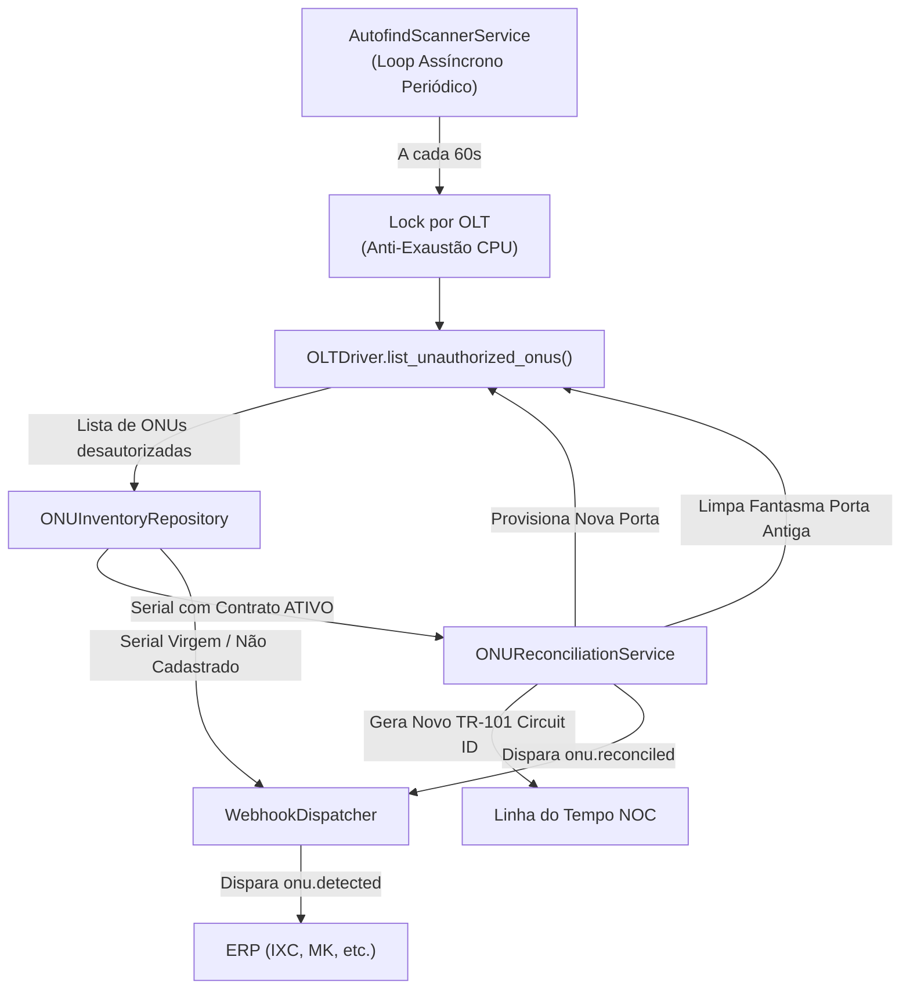

# Autofind Scanner em Segundo Plano & Auto-Conciliação de Rede (v1)

## 1. Visão Geral & Motivação

No cenário real de telecomunicações e operação de redes PON (GPON, EPON, XGS-PON):
- Técnicos em campo ativam novas ONUs diariamente, muitas vezes ligando o equipamento antes mesmo do cadastro ser concluído no ERP.
- Durante manutenções noturnas, manobras de carga entre OLTs, fusões invertidas de cabos ópticos troncos ou mudanças de endereço de assinantes, ONUs previamente provisionadas em uma porta/OLT caem e acendem em portas ou OLTs diferentes.
- Atualmente, a detecção de ONUs desautorizadas (`unauthorized`) depende de consultas manuais ou pontuais (`GET /api/v1/olts/{id}/unauthorized`).

O **Autofind Scanner Service (`AutofindScannerService`)** transforma o OLTAPI em um sistema **autônomo e pró-ativo**:
Um worker assíncrono em background sonda periodicamente todas as OLTs cadastradas, identifica qualquer ONU desautorizada na fibra e executa o roteamento inteligente:
1. **Se a ONU possui contrato ATIVO no inventário:**
   - Detecta o deslocamento físico (mesma OLT em outra porta, ou cross-OLT).
   - Aciona o motor de auto-recuperação (`ONUReconciliationService.reconcile_field_event`).
   - Provisiona na nova porta física, desprovisiona o fantasma na porta antiga, recalcula o Circuit ID (Broadband Forum TR-101), grava no histórico cronológico do NOC e emite o webhook `onu.reconciled` assinado com HMAC SHA-256 para o ERP.
2. **Se a ONU for virgem (não cadastrada no inventário):**
   - Dispara imediatamente o webhook `onu.detected` para que o ERP saiba que uma nova ONU acabou de acender na fibra (informando serial, OLT, porta e timestamp).
3. **Se a ONU estiver em estoque (`IN_STOCK`) ou cancelada (`CANCELLED`):**
   - Rejeita herança indevida de dados antigos e emite alerta operacional.

---

## 2. Requisitos Não-Funcionais & Segurança

1. **Proteção de CPU e Sessões das OLTs (Security First):**
   - OLTs não toleram dezenas de conexões concorrentes ou comandos em loop infinito.
   - O scanner utiliza **lock assíncrono por OLT (`asyncio.Lock`)** para que scans nunca sobreponham conexões ativas de provisionamento ou diagnósticos manuais.
   - Intervalo de varredura configurável (padrão 60s, mínimo defensivo de 10s).
   - Isolamento de falhas: se uma OLT estiver offline ou sofrer timeout, a exceção é capturada, contabilizada no relatório da rodada e **nunca** derruba o loop nem interrompe as demais OLTs.
2. **Identificadores UUIDv7 (RFC 9562):**
   - Cada ciclo de varredura recebe um `cycle_id` único baseado em UUIDv7 com ordenação cronológica nativa.
3. **Zero Bloqueio no Event Loop do FastAPI:**
   - As chamadas de driver (que podem envolver I/O de rede com sockets/SSH/telnet) são executadas via threads ou pools assíncronos (`asyncio.to_thread` / executor).
4. **Controle Operacional via API REST & HATEOAS:**
   - `GET /api/v1/scanner/status`: Exibe status (executando/parado), intervalo, última execução, métricas e links HATEOAS.
   - `POST /api/v1/scanner/start`: Inicia o worker em background.
   - `POST /api/v1/scanner/stop`: Interrompe graciosamente o worker.
   - `POST /api/v1/scanner/run-now`: Executa uma varredura avulsa imediata sob demanda e retorna os resultados detalhados da rodada.

---

## 3. Arquitetura do Scanner

---

## 4. Modelagem de Dados

### `ScannerStatus`
- `is_running: bool`
- `interval_seconds: int`
- `last_run_at: Optional[datetime]`
- `last_run_duration_ms: Optional[float]`
- `last_cycle_id: Optional[str]` (UUIDv7)
- `total_cycles: int`
- `total_onus_detected: int`
- `total_onus_reconciled: int`
- `total_errors: int`
- `_links: Dict[str, Link]`

### `ScannerRunResult`
- `cycle_id: str` (UUIDv7)
- `started_at: datetime`
- `completed_at: datetime`
- `duration_ms: float`
- `olts_scanned: int`
- `detected_onus_count: int`
- `reconciled_onus_count: int`
- `virgin_onus_count: int`
- `errors: List[str]`
- `details: List[Dict[str, Any]]`
