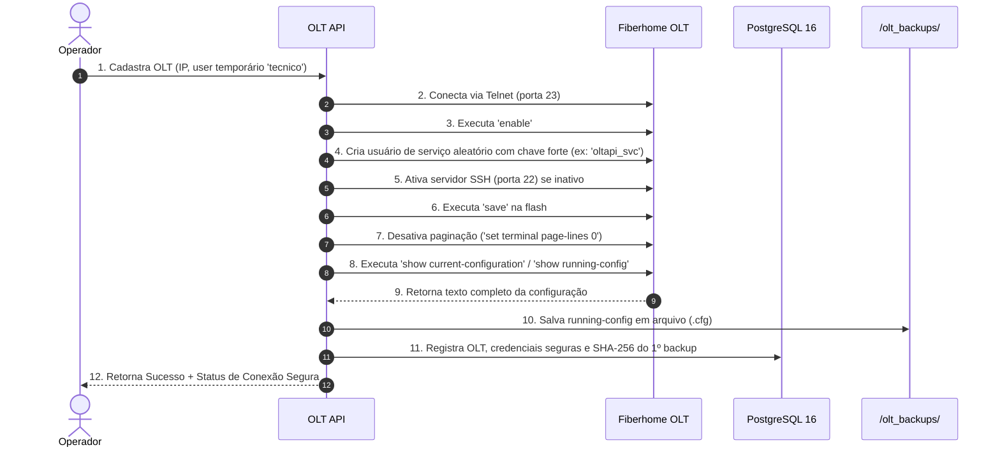

# Brainstorming v2: Estratégia de Coleta de Backup — Terminal vs. FTP/TFTP

## 1. Avaliação de Segurança (Regra Mandatória)
- **Aumenta ou diminui a segurança?**
  - **Coleta via Terminal (SSH):** **AUMENTA A SEGURANÇA.** Utiliza o próprio canal criptografado já estabelecido entre a API e a OLT. Nenhuma porta extra (como FTP inseguro porta 21) precisa ser aberta na infraestrutura.
  - **Envio via FTP tradicional:** **DIMINUI A SEGURANÇA.** O protocolo FTP tradicional (RFC 959) transmite dados e credenciais em texto puro. Além disso, a OLT precisa alcançar o servidor da API (exigindo rotas reversas ou furos em firewalls).
  - **Envio via SFTP/SCP:** Seguro, porém muitas OLTs legadas Fiberhome (firmwares antigos AN5516) não possuem cliente SFTP/SCP compilado, suportando apenas cliente TFTP ou FTP básico.

---

## 2. Comparativo Técnico: Terminal vs. FTP

| Critério | Método 1: Stream Direto pelo Terminal (Recomendado) | Método 2: Upload via FTP/TFTP |
| :--- | :--- | :--- |
| **Como funciona?** | A API executa `show current-configuration` ou `show running-config` na sessão SSH/Telnet e captura o texto retornado no buffer. | A API envia o comando `upload file cfg to ftp <ip> <user> <pass>` e a OLT faz upload para um servidor FTP da API. |
| **Dependência de Rede** | **Zero dependência extra.** Se a API já conectou na OLT, o backup é garantido. Funciona através de NAT, VPN e CGNAT. | **Alta dependência.** A OLT precisa conseguir abrir conexão de volta para o IP da API na porta 21/20 (Data Channel). |
| **Infraestrutura** | Não requer nenhum serviço adicional no Docker. | Requer container de FTP rodando no Docker Compose (`vsftpd` ou similar) com portas expostas. |
| **Velocidade** | 2 a 8 segundos (suficiente para agendamentos e rotinas). | 1 a 2 segundos (transferência de binário direto). |
| **Legibilidade / Diff** | Formato texto puro direto para diff de alterações e auditoria SHA-256. | Frequentemente em formato binário proprietário (.bin / .tar), dificultando diff textual. |

---

## 3. Workflow de Homologação da Fiberhome

O fluxo ideal de homologação para cadastrar uma nova Fiberhome de forma 100% autônoma e segura:

---

## 4. Recomendação Estratégica
1. **Adotar a Coleta via Terminal como padrão:** É a mais simples, segura, não exige servidor FTP extra e funciona em 100% das topologias de rede.
2. **Suporte a FTP como modo avançado:** Manter a porta aberta para, no futuro, caso o cliente tenha OLTs massivas (chassi de 16 slots), habilitar um modo de transferência FTP dedicado.
