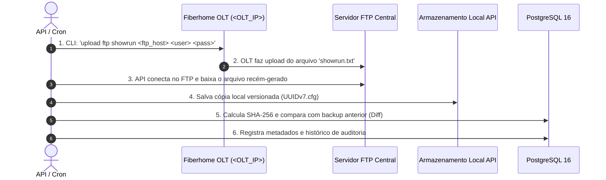

# Brainstorming v4: Arquitetura de Servidor FTP Centralizado & Análise de Diff

## 1. Avaliação de Escopo: Foge do Projeto?
**NÃO FOGE DO PROJETO. Encaixa-se 100% na arquitetura do Módulo de Disaster Recovery & Backup.**
- O PRD e a v1 de Backup já especificavam:
  - Auditoria de integridade (hash SHA-256).
  - Cálculo de Unified Diff (detecção de linhas adicionadas/removidas entre versões).
  - Histórico de versões e retenção de backups.
- Adicionar o suporte a **Servidor FTP Centralizado do Provedor** é o elo que viabiliza a coleta oficial em OLTs como a Fiberhome AN5516 (cujo comando nativo do fabricante é `upload ftp showrun`).

---

## 2. Desenho da Arquitetura com Servidor FTP Central

---

## 3. Prós e Contras da Abordagem FTP Centralizado

### Prós (Vantagens):
1. **Padrão de Mercado para Fiberhome:** Respeita a forma como o fabricante implementou a exportação do `showrun`.
2. **Desacoplamento de Rede:** Nem a API precisa receber conexões da OLT, nem a OLT precisa alcançar o IP dinâmico da máquina do desenvolvedor. Ambos apenas precisam alcançar o servidor FTP central.
3. **Histórico e Diff Integrados:** Uma vez que a API baixa o arquivo do FTP, todo o mecanismo de Diff textual e auditoria SHA-256 continua funcionando de forma transparente.

### Contras & Cuidados:
1. **Credenciais no Tráfego FTP:** O protocolo FTP trafega credenciais em texto claro entre a OLT e o FTP. Recomenda-se que o servidor FTP esteja em rede/VLAN privada de gerência do ISP.
2. **Controle de Concorrência de Arquivos:** Se duas OLTs gravarem com o mesmo nome (ex: `showrun.txt`), pode haver sobrescrita no FTP. A API deve instruir nomes únicos com timestamp ou organizar por diretórios (`/<olt_name>/showrun_<timestamp>.txt`).
