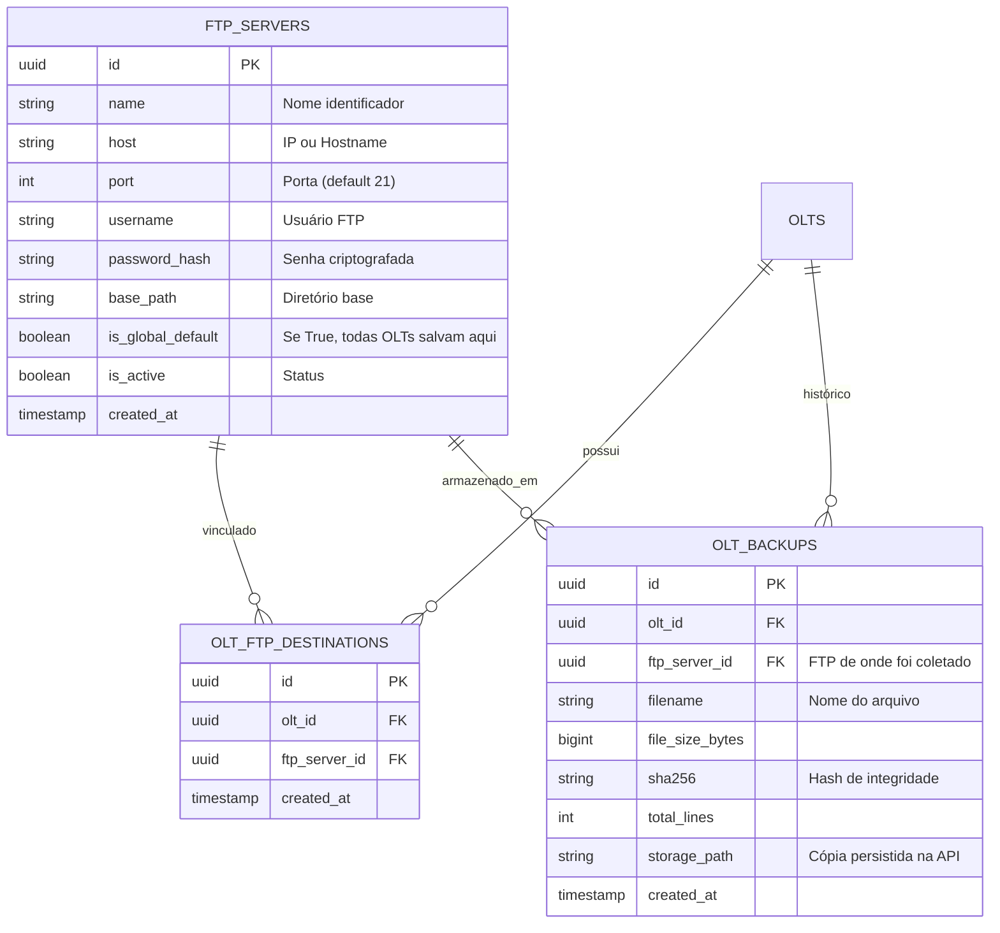

# Brainstorming v7: Arquitetura Multi-FTP (Destinos Múltiplos, Globais e por OLT)

## 1. Avaliação de Segurança (Regra Mandatória)
- **Aumenta ou diminui a segurança?** **AUMENTA A SEGURANÇA (Redundância Geográfica & Alta Disponibilidade de Disaster Recovery).**
  - **Cenário de risco real:** Se um consultor ou provedor mantém seus backups em apenas um servidor FTP local e o disco falha ou o servidor sofre um ataque, perde-se todo o histórico.
  - **Com Multi-FTP:** A OLT ou a API garante que o backup seja replicado em múltiplos destinos independentes (ex: 1 FTP local no datacenter do cliente + 1 FTP externo/nuvem da consultoria).

---

## 2. Cenário de Negócio: Provedores e Consultorias Multi-Tenant

Um consultor ou empresa de gerenciamento de redes pode atender vários ISPs simultaneamente:
- **FTP Global:** Marcado com `is_global_default = True`. Toda e qualquer OLT cadastrada na API envia automaticamente para este repositório central.
- **FTPs Específicos por OLT:** Cada OLT pode ter 1 ou mais destinos específicos (ex: o FTP exclusivo daquele provedor específico).
- **Regra de Despacho:**
  Ao disparar o backup de uma OLT:
  `Destinos = {FTPs vinculados à OLT} U {FTPs Globais Ativos}`

---

## 3. Modelo Relacional no PostgreSQL 16 (UUIDv7)

---

## 4. Endpoints REST da API

### Gerenciamento de Servidores FTP:
- `POST /api/v1/ftp-servers`: Cadastra um novo servidor FTP (com validação de conectividade imediata).
- `GET /api/v1/ftp-servers`: Lista todos os servidores FTP cadastrados (com status de saúde e flag global).
- `GET /api/v1/ftp-servers/{id}`: Detalhes do servidor FTP.
- `PUT /api/v1/ftp-servers/{id}`: Atualiza credenciais, host ou flag global.
- `DELETE /api/v1/ftp-servers/{id}`: Remove o servidor FTP.

### Vinculação OLT ➔ FTPs:
- `POST /api/v1/olts/{id}/ftp-servers`: Associa um ou mais servidores FTP específicos a uma OLT.
- `GET /api/v1/olts/{id}/ftp-servers`: Lista os servidores FTP configurados para aquela OLT (específicos + globais herdados).
- `DELETE /api/v1/olts/{id}/ftp-servers/{ftp_id}`: Remove a associação específica.

### Disparo do Backup Multi-Destino:
- `POST /api/v1/olts/{id}/backups`:
  - Itera sobre todos os destinos aplicáveis (específicos + global).
  - Executa o upload em cada um dos servidores FTP configurados.
  - Baixa a cópia para a API, calcula o SHA-256 e gera o Diff de alterações.
