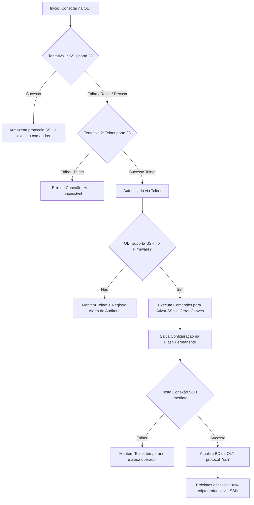

# Brainstorming v2: Workflow de Fallback Telnet e Auto-Habilitação de SSH

## 1. Avaliação de Segurança (Regra Mandatória)
- **Aumenta ou diminui a segurança?** **AUMENTA EXPRESSIVAMENTE A SEGURANÇA.**
  - **Cenário atual de muitas redes:** OLTs legadas vêm de fábrica com Telnet (porta 23) aberto e SSH desabilitado. Operadores trafegam logins e senhas de root em texto puro através da rede.
  - **Com a funcionalidade proposta:** A API atua como um agente ativo de **Hardening (Fortalecimento de Segurança)**. O Telnet é usado estritamente como bootstrap inicial e canal de recuperação; uma vez autenticado, a API ativa a criptografia SSH na OLT e migra os próximos acessos para a porta 22 segura.

---

## 2. Desenho do Workflow de Auto-Elevação (SSH Bootstrap)

---

## 3. Peculiaridades Técnicas por Fabricante

### A. Fiberhome (AN5516 / AN6000)
- **Acesso CLI Inicial:** Ao conectar via Telnet, a Fiberhome exige:
  - `Login: noc` / `Password: ...`
  - Entrar no modo privilegiado: `enable` (com senha de enable, se houver).
  - Entrar no modo de configuração: `cd admin` ou `config`.
- **Comandos de Ativação do SSH:**
  - `set ssh server enable`
  - Configurar versão SSH: `set ssh server version 2` (para forçar SSHv2 e recusar SSHv1 inseguro).
  - Gerar chaves criptográficas (em alguns firmwares): `crypto key generate rsa` ou gerada automaticamente ao dar `set ssh server enable`.
  - Salvar configuração na flash:
    - `save` ou `write` ou `commit` (dependendo da versão de firmware GC8B/GC4B/GCOB).

### B. Desafios & Cuidados
1. **CPU Fraca da OLT na geração de chaves:** Processadores de placas de controle antigas (ex: HSWA / MSPO) podem levar até 10-15 segundos para gerar chaves RSA 2048. O timeout de socket deve ser tolerante.
2. **Senha de Privilégio (Enable Password):** Alguns provedores colocam uma senha para o login Telnet e outra senha diferente para o comando `enable`. A API precisa suportar o campo opcional `enable_password` no cadastro da OLT.
3. **Firmware que exige reinicialização:** Em raríssimos firmwares antigos da Fiberhome, o serviço SSH só sobe após o reload do daemon de rede. Devemos testar antes se sobe a quente.

---

## 4. Recomendações
1. **Adicionar o Driver Telnet na API:** Criar uma camada de abstração de conexão `BaseTerminalDriver` com implementações `SSHTerminalDriver` e `TelnetTerminalDriver`.
2. **Flag de Configuração:** Criar uma opção na OLT: `auto_upgrade_ssh: bool = True` (ativada por padrão).
3. **Validação Preliminar:** Antes de qualquer alteração de código, verificar via script de diagnóstico simples se a porta 23 da OLT física de teste está aberta e aceitando negociação Telnet.
