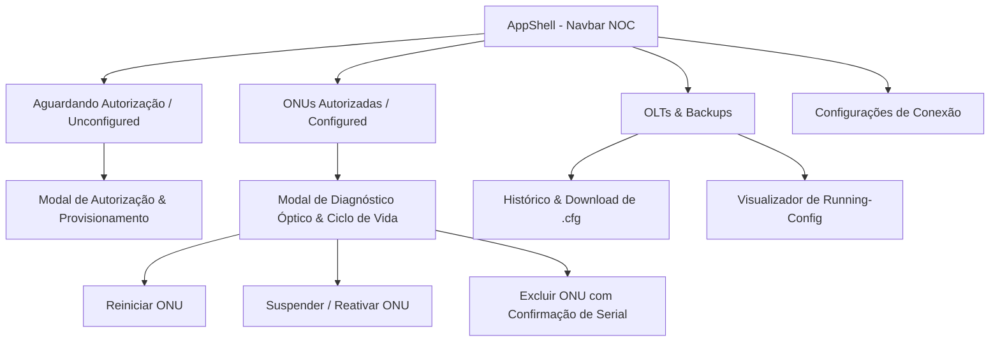

# 🖥️ Frontend NOC (Central de Operações em Flutter)

O **Frontend NOC do OLTAPI** é uma aplicação multi-plataforma moderna desenvolvida em **Flutter**, projetada especificamente para provedores de internet (ISPs) e centros de operações de rede (NOC). A aplicação oferece gerenciamento unificado, visualização de telemetria óptica em tempo real, provisionamento em 1-clique e ciclo de vida de ONUs e OLTs.

---

## 🎯 Princípios de Design & Arquitetura

1. **Desacoplamento Radical (API-First):** O frontend opera de forma 100% independente do backend FastAPI. O backend expõe exclusivamente endpoints REST JSON, enquanto o frontend reside no diretório `frontend/` e se comunica via HTTP com injeção segura de credenciais (`X-API-Key`).
2. **Design System NOC Dark Mode:** Paleta de cores em modo escuro de alto contraste (`#0B0F17`, `#131A24`, `#222F42`, `#2563EB`) projetada para ambientes de monitoramento 24/7 sem fadiga visual.
3. **Semântica Óptica Instantânea:** Indicadores visuais claros para qualidade do sinal óptico recebido (Rx Power em dBm):
   - 🟢 **Excelente:** Sinal entre `-8.0 dBm` e `-25.0 dBm`.
   - 🟡 **Atenção:** Sinal entre `-25.0 dBm` e `-28.0 dBm` (limítrofe).
   - 🔴 **Crítico / Atenuado:** Sinal menor que `-28.0 dBm` ou maior que `-8.0 dBm` (saturado).
4. **Tolerância Zero a Overflows:** Componentes construídos com proteções defensivas (`SingleChildScrollView`, `Flexible`, `Expanded`, `TextOverflow.ellipsis`) garantindo usabilidade impecável em qualquer resolução de tela (Desktop macOS/Linux/Windows e Web).
5. **Zero Dados Falsos:** Interfaces fiéis à realidade, sem dados fictícios ou cards decorativos simulados. Quando não há dados, exibe estados neutros e informativos.

---

## 🧭 Estrutura e Telas da Aplicação



---

### 1. Barra Superior NOC (`AppShell`)
- **Identidade Visual:** Logo OLTAPI com chip semântico `NOC`.
- **Abas de Navegação:** Navegação rápida com contadores dinâmicos de ONUs pendentes de autorização.
- **Seletor Rápido de OLT:** Dropdown que permite alternar a OLT ativa em 1 clique.
- **Indicador de Conectividade do Backend:** Ponto luminoso pulsante com telemetria de latência em milissegundos (`Online • 8ms` ou `Offline`).
- **Sincronização Global:** Botão de recarga com spinner animado para re-sincronizar OLTs, pendências e inventário.

---

### 2. Aguardando Autorização (`UnconfiguredScreen`)
Exibe em tempo real as ONUs recém-conectadas na rede PON da OLT selecionada (Autofind):
- **Colunas:** Porta PON, Número de Série (SN) em tipografia monospace, Modelo detectado e Timestamp de descoberta.
- **Autorização em 1-Clique:** Botão "Autorizar" que abre o modal seguro solicitando:
  - Nome do Assinante / Descrição do Cliente
  - VLAN de Serviço (validação estrita 1 a 4094)
  - Perfil de Tráfego (ex: `DEFAULT`, `PLAN_200M`)
- **Empty State Informativo:** Exibe estado limpo e neutro quando todas as ONUs da porta PON já estiverem homologadas.

---

### 3. ONUs Autorizadas (`ConfiguredScreen`)
Inventário unificado de clientes ativos e suspensos na rede FTTH:
- **Busca Instantânea:** Filtro em tempo real por Número de Série, Nome do Assinante, Porta PON ou VLAN.
- **Filtro de Status:** Seleção rápida entre *Todas*, *Ativas (Online)* e *Suspensas / Bloqueadas*.
- **Tabela de Dados:** Exibe Serial, Assinante, Porta PON, ONU ID, VLAN e badge de status contratual.
- **Ação Diagnóstico:** Abre o painel completo de detalhes da ONU.

---

### 4. Diagnóstico Óptico & Ciclo de Vida (`OnuDetailDialog`)
Painel completo de saúde da fibra e operações remotas:
- **Potência Óptica em Tempo Real:**
  - **Rx ONU (Downlink):** Medição da potência recebida pela ONU vinda da OLT.
  - **Tx ONU (Uplink):** Potência transmitida pelo laser da ONU.
  - **Rx OLT:** Potência recebida na porta PON da OLT vinda da ONU.
- **Ações de Ciclo de Vida:**
  - 🔄 **Reiniciar ONU:** Envia comando de reboot remoto OMCI com diálogo de confirmação.
  - ⏸️ / ▶️ **Suspender / Reativar:** Altera o estado do provisionamento para suspensão por inadimplência ou desbloqueio.
  - 🛑 **Desprovisionar / Excluir:** Operação de alto risco com **dupla confirmação obrigatória**, exigindo a digitação do número de série alfanumérico exato da ONU antes de habilitar a remoção na OLT.

---

### 5. OLTs & Gestão de Backups (`OltsScreen`)
Controle do parque de hardware físico e políticas de disaster recovery:
- **Tabela de Concentradores:** Nome da OLT, Fabricante (`FIBERHOME`, `VSOL`), IP, Porta e Protocolo (`Telnet`/`SSH`).
- **Teste de Conectividade:** Dispara ping/teste de socket contra a porta de gerência da OLT, exibindo a latência real em ms.
- **Novo Backup:** Dispara a extração imediata da configuração e geração de hash SHA-256.
- **Visualizador de Running-Config:** Exibe a configuração ativa da OLT em modal com tipografia monospace e botão para copiar todo o texto.
- **Histórico de Backups (`OltBackupsDialog`):** Lista todos os arquivos `.cfg` gerados, tamanho formatado (B/KB/MB), hash SHA-256 e opção de visualização/download.

---

### 6. Configurações (`SettingsScreen`)
- **Parâmetros da Conexão:** URL base da API (padrão: `http://localhost:8000`) e chave `X-API-Key`.
- **Armazenamento Persistente:** Gravação segura no cliente via `SharedPreferences`.
- **Teste & Validação:** Botão "Testar e Salvar Configurações" com feedback imediato de sucesso ou diagnóstico de falha.

---

## 🛠️ Como Executar o Frontend

### Pré-requisitos
- Flutter SDK 3.24+ (Dart 3.5+) instalado no ambiente (`flutter --version`).

### Executando em Modo Desktop (macOS / Linux / Windows)
```bash
# Navegue até o diretório do frontend
cd frontend

# Baixe as dependências
flutter pub get

# Execute no macOS Desktop
flutter run -d macos
```

### Executando em Modo Web (Google Chrome)
```bash
cd frontend
flutter run -d chrome
```

---

## 🧪 Testes Automatizados & Qualidade de Código

O frontend conta com uma suíte de testes unitários e de integração de widgets:

```bash
cd frontend

# Análise estática de lints e boas práticas
flutter analyze

# Execução dos testes unitários de modelos e widgets
flutter test
```

**Cobertura de Testes:**
- Deserialização e serialização de modelos (`OltModel`, `UnauthorizedOnu`, `ConfiguredOnu`, `OnuDiagnostics`, `BackupModel`).
- Lógica semântica de classificação de sinal óptico em dBm.
- Testes de renderização de widgets com `MockClient` HTTP garantindo navegação sem falhas e tolerância zero a pixel overflow.
