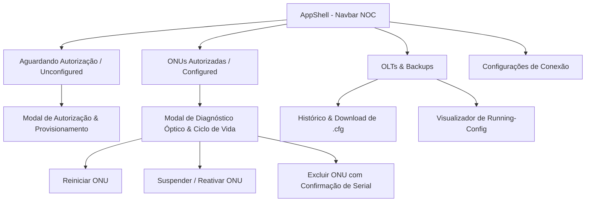
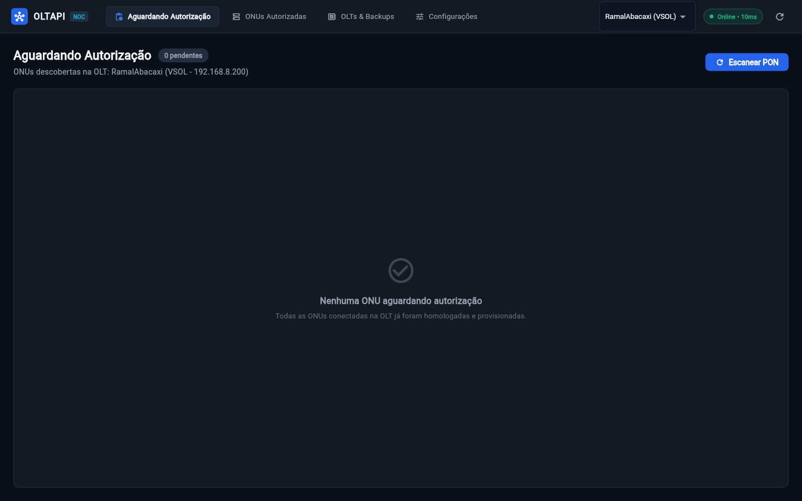
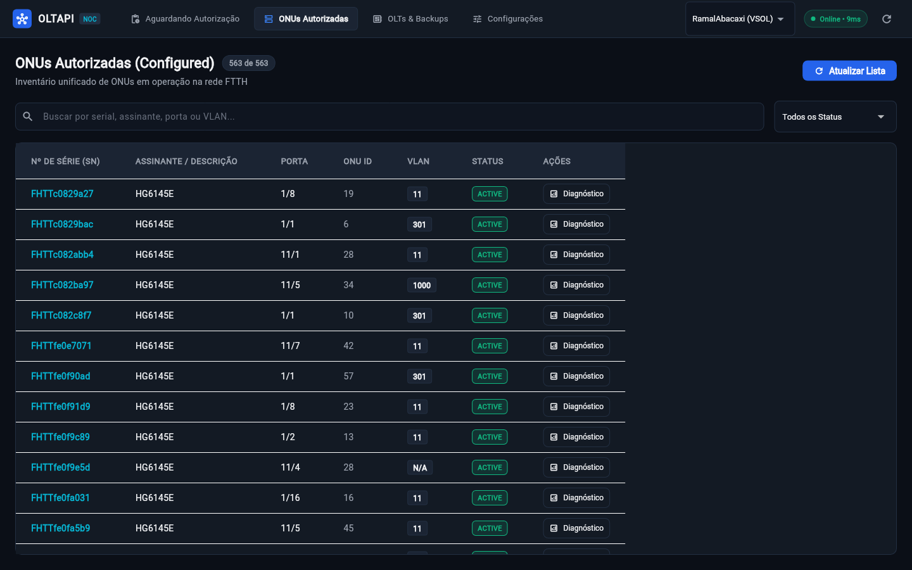
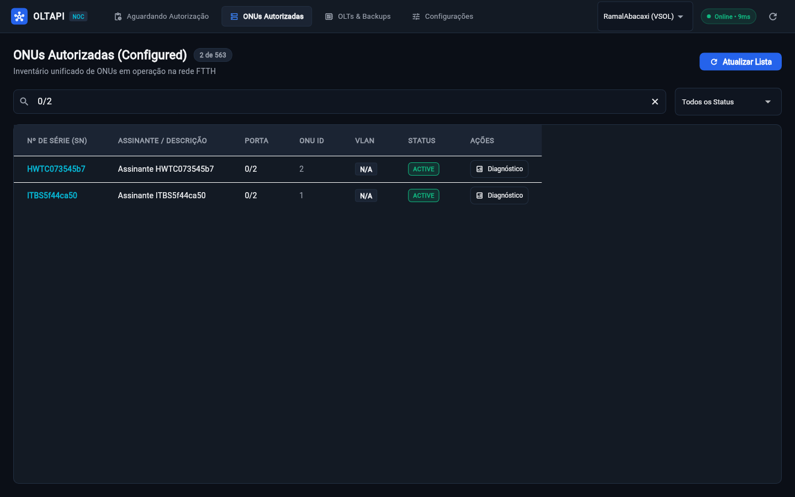
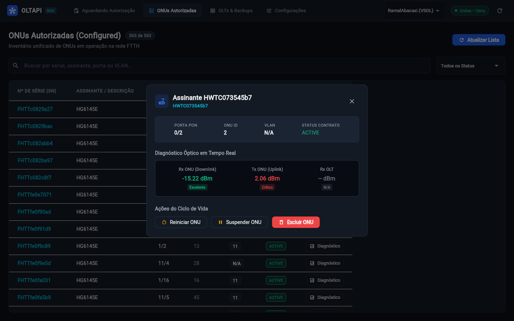
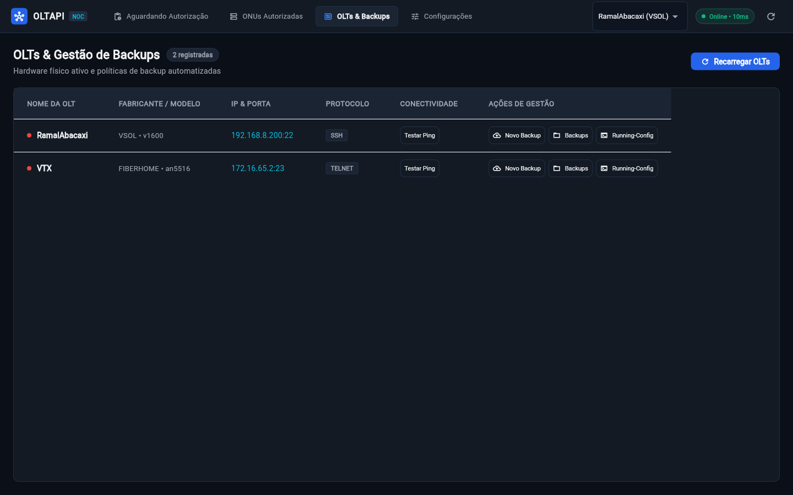
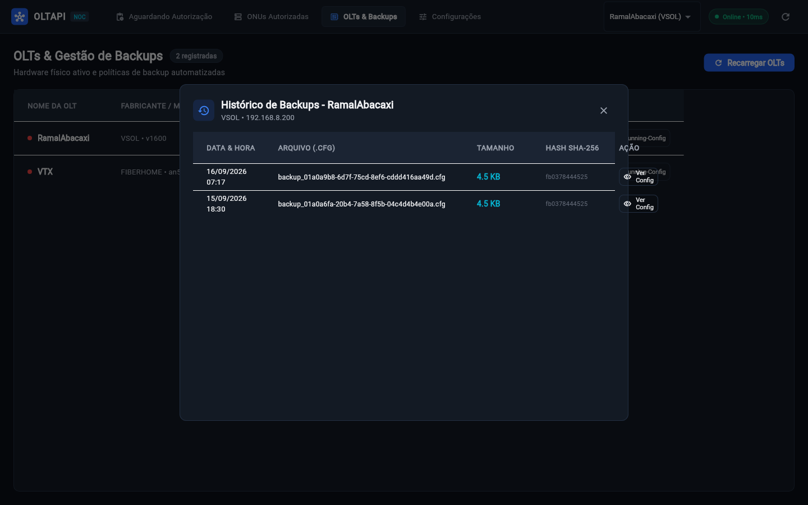
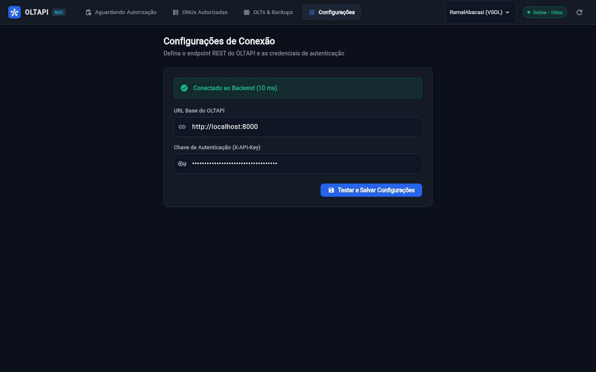

# 🖥️ Frontend NOC (Central de Operações em Flutter)

O **Frontend NOC do OLTAPI** é uma aplicação multi-plataforma moderna desenvolvida em **Flutter**, projetada especificamente para provedores de internet (ISPs) e centros de operações de rede (NOC). A aplicação oferece gerenciamento unificado, visualização de telemetria óptica em tempo real, provisionamento em 1-clique e ciclo de vida de ONUs e OLTs.

---

## 🎯 Princípios de Design & Arquitetura

1. **Desacoplamento Radical (API-First):** O frontend opera de forma 100% independente do backend FastAPI. O backend expõe exclusivamente endpoints REST JSON, enquanto o frontend reside no diretório `frontend/` e se comunica via HTTP com injeção segura de credenciais (`X-API-Key`).
2. **Design System NOC Dark Mode:** Paleta de cores em modo escuro de alto contraste (`#0B0F17`, `#131A24`, `#222F42`, `#2563EB`) projetada para ambientes de monitoramento 24/7 sem fadiga visual.
3. **Semântica Óptica Instantânea:** Indicadores visuais claros para qualidade do sinal óptico recebido (Rx Power em dBm):
   - 🟢 **Excelente:** Sinal entre `-8.0 dBm` e `-25.0 dBm`.
   - 🟡 **Atenção:** Sinal entre `-25.0 dBm` e `-28.0 dBm` (limítrofe).
   - 🔴 **Crítico / Atenuado:** Sinal menor que `-28.0 dBm` ou maior que `-8.0 dBm` (saturado).
4. **Tolerância Zero a Overflows:** Componentes construídos com proteções defensivas (`SingleChildScrollView`, `Flexible`, `Expanded`, `TextOverflow.ellipsis`) garantindo usabilidade impecável em qualquer resolução de tela (Desktop macOS/Linux/Windows e Web).
5. **Zero Dados Falsos:** Interfaces fiéis à realidade, sem dados fictícios ou cards decorativos simulados. Quando não há dados, exibe estados neutros e informativos.

---

## 🧭 Estrutura e Telas da Aplicação



---

### 1. Barra Superior NOC (`AppShell`) & Aguardando Autorização (`UnconfiguredScreen`)
A tela inicial conecta-se diretamente ao hardware e monitora novas ONUs conectadas fisicamente que aguardam autorização (Autofind GPON).
- **Identidade Visual:** Logo OLTAPI com chip semântico `NOC`.
- **Abas de Navegação:** Navegação rápida com contadores dinâmicos de ONUs pendentes de autorização.
- **Seletor Rápido de OLT:** Dropdown que permite alternar a OLT ativa em 1 clique.
- **Indicador de Conectividade do Backend:** Ponto luminoso pulsante com telemetria de latência em milissegundos (`Online • 10ms`).
- **Empty State Seguro:** Exibe estado limpo e informativo quando todas as ONUs já estão homologadas.



---

### 2. ONUs Autorizadas (`ConfiguredScreen`) — Inventário FTTH
Inventário unificado de clientes ativos e suspensos na rede FTTH:
- **Busca Instantânea:** Filtro em tempo real por Número de Série, Nome do Assinante, Porta PON ou VLAN.
- **Filtro de Status:** Seleção rápida entre *Todas*, *Ativas (Online)* e *Suspensas / Bloqueadas*.
- **Tabela de Dados:** Exibe Serial, Assinante, Porta PON, ONU ID, VLAN e badge de status contratual.
- **Ação Diagnóstico:** Abre o painel completo de telemetria da ONU.



#### Filtro por Porta Física da OLT V-SOL (Porta `0/2`)
Isolamento instantâneo das ONUs ativas na porta GPON 0/2 da OLT V-SOL física na bancada de testes:



---

### 3. Diagnóstico Óptico em Tempo Real & Ciclo de Vida (`OnuDetailDialog`)
Ao clicar no botão **Diagnóstico** em qualquer ONU, o frontend consulta em tempo real a potência do laser via SSH na OLT:

#### Telemetria Óptica da ONU Huawei (`HWTC073545b7`)
- **Porta / ID:** GPON `0/2` : ID `2`
- **Rx ONU (Downlink):** `-15.22 dBm` *(Classificação: Excelente)*
- **Tx ONU (Uplink):** `2.06 dBm` *(Alerta / Nível Crítico de Potência)*
- **Ações Rápidas:** Reiniciar ONU, suspender por inadimplência e excluir.



#### Telemetria Óptica da ONU Intelbras (`ITBS5f44ca50`)
- **Porta / ID:** GPON `0/2` : ID `1`
- **Rx ONU (Downlink):** `-14.66 dBm` *(Classificação: Excelente)*
- **Tx ONU (Uplink):** `3.49 dBm`


---

### 4. OLTs & Gestão de Backups (`OltsScreen`)
Controle do parque de hardware físico e políticas de disaster recovery:
- **Tabela de Concentradores:** Nome da OLT, Fabricante (`FIBERHOME`, `VSOL`), IP, Porta e Protocolo (`Telnet`/`SSH`).
- **Teste de Conectividade:** Dispara ping/teste de socket contra a porta de gerência da OLT, exibindo a latência real em ms.
- **Novo Backup:** Dispara a extração imediata da configuração e geração de hash SHA-256.
- **Visualizador de Running-Config:** Exibe a configuração ativa da OLT em modal com tipografia monospace e botão para copiar todo o texto.



#### Histórico de Backups com Hashes Criptográficos (`OltBackupsDialog`)
Visualização dos snapshots preventivos gerados com verificação de integridade SHA-256 e download do arquivo `.cfg`:



---

### 5. Configurações & Conectividade (`SettingsScreen`)
- **Parâmetros da Conexão:** URL base da API (padrão: `http://localhost:8000`) e chave `X-API-Key`.
- **Armazenamento Persistente:** Gravação segura no cliente via `SharedPreferences`.
- **Healthcheck Automático:** Ponto de checagem com feedback em tempo real de latência de resposta (`Conectado ao Backend • 10 ms`).



---

## 🛠️ Como Executar o Frontend

### Pré-requisitos
- Flutter SDK 3.24+ (Dart 3.5+) instalado no ambiente (`flutter --version`).

### Executando em Modo Desktop (macOS / Linux / Windows)
```bash
# Navegue até o diretório do frontend
cd frontend

# Baixe as dependências
flutter pub get

# Execute no macOS Desktop
flutter run -d macos
```

### Executando em Modo Web (Google Chrome)
```bash
cd frontend
flutter run -d chrome
```

---

## 🧪 Testes Automatizados & Qualidade de Código

O frontend conta com uma suíte de testes unitários e de integração de widgets:

```bash
cd frontend

# Análise estática de lints e boas práticas
flutter analyze

# Execução dos testes unitários de modelos e widgets
flutter test
```

**Cobertura de Testes:**
- Deserialização e serialização de modelos (`OltModel`, `UnauthorizedOnu`, `ConfiguredOnu`, `OnuDiagnostics`, `BackupModel`).
- Lógica semântica de classificação de sinal óptico em dBm.
- Testes de renderização de widgets com `MockClient` HTTP garantindo navegação sem falhas e tolerância zero a pixel overflow.
