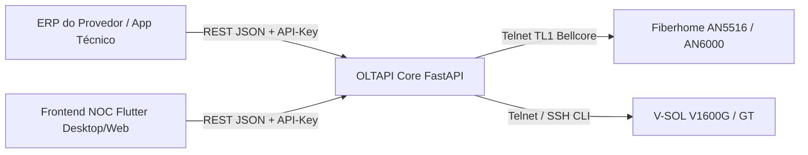

# 🌐 OLTAPI - Documentação Oficial

**API REST Unificada, Agnóstica e Aberta para Provisionamento, Telemetria Óptica e Disaster Recovery Multi-OLT**

---

## 🎯 Visão Geral

O **OLTAPI** foi concebido para resolver um dos gargalos mais críticos enfrentados por Provedores de Internet (ISPs): a **heterogeneidade das redes ópticas**. Cada fabricante de OLT adota dialetos de terminal (CLI) distintos, formatos proprietários e particularidades operacionais.

O OLTAPI atua como uma **camada de abstração de alta performance e desacoplada**, permitindo que ERPs de telecomunicações (IXC, MK-Auth, SGP, Voalle, etc.), centros de operações (NOC) ou técnicos de campo executem operações completas através de um **único contrato JSON padronizado** ou através da moderna **interface frontend Flutter NOC**.

---

## 🖥️ Central de Operações NOC (Desktop & Web)

Além dos endpoints RESTful de alta performance, o projeto disponibiliza uma **Central de Operações NOC (Flutter)** completa, homologada diretamente contra hardware físico de bancada (V-SOL e Fiberhome) com tráfego e potências ópticas reais:

### ⚡ Fluxos Operacionais em Destaque

=== "📊 Diagnóstico Óptico & Ciclo de Vida"
    Consulta instantânea de telemetria física direto da fibra óptica (Rx/Tx em dBm) com alertas semânticos de atenuação ou saturação, além de comandos defensivos de **Reboot Remoto (OMCI)**, **Suspensão por Inadimplência**, **Reativação** e **Exclusão Atômica**:
    
    

=== "🔍 Autofind & Provisionamento Imediato"
    Varredura contínua de novas ONUs conectadas fisicamente que aguardam autorização (Autofind GPON), permitindo homologação e provisionamento imediato em 1-clique sem necessidade de acesso ao terminal:
    
    

=== "💾 Concentradores & Backups com SHA-256"
    Gestão de todo o parque de OLTs ativas, teste de conectividade TCP em tempo real (latência em ms), histórico de backups com cálculo de hash SHA-256 e visualizador integrado de running-config:
    
    

> 📖 Confira o detalhamento de cada tela, paleta de cores e arquitetura no [Guia Completo do Frontend NOC](frontend_noc.md).

---

## 🚀 Principais Capacidades

* 🟢 **Concentradores 100% Homologados em Bancada:** Drivers homologados em hardware físico com tráfego real para **Fiberhome** (AN5516/AN6000 via TL1) e **V-SOL** (série V1600 via CLI).
* 🖥️ **Central de Operações NOC em Flutter:** Interface gráfica moderna (Desktop macOS/Linux/Windows e Web) com tema Dark NOC de alto contraste, telemetria óptica colorimétrica, aprovação de ONUs em 1-clique e ações operacionais com proteção defensiva de segurança.
* ⚡ **Onboarding Zero-Touch & Wizard Guiado:** Detecção de protocolos, inspeção não-destrutiva de portas AUX e In-Band, comissionamento de VLANs com gravação atômica na flash e backup Baseline v0 obrigatório.
* 📊 **Telemetria Óptica Dupla em Tempo Real:** Leitura direta de **ONU RX** (potência recebida pelo assinante), **ONU TX** e **OLT RX** (potência recebida na porta PON da OLT) em dBm.
* 🔄 **Auto-Recuperação Reativa (Broadband Forum TR-101):** Rastreamento perpétuo de hardware vinculado ao contrato comercial do ERP, resolvendo cutovers com desprovisionamento da posição fantasma e recálculo dinâmico do Circuit ID.
* 💾 **Disaster Recovery & Padrão Canônico de Backup:** Envio direto via FTP com a sintaxe nativa da OLT, com fallback gracioso para captura do running-config, hash criptográfico SHA-256 e comparador de unified diff.
* 🛡️ **Segurança e Hardening:** Criptografia de credenciais em repouso com Fernet AES-256, controle de acesso RBAC multi-tenant, sanitização defensiva contra injeção CLI e validação estrita de tokens.

---

## 🗺️ Navegação Rápida

Explore as seções da documentação:

::: cards
- [🐳 **Guia de Instalação**](instalacao.md)  
  Como inicializar a stack de produção com Docker Compose e PostgreSQL 16.
- [🖥️ **Frontend NOC (Flutter)**](frontend_noc.md)  
  Conheça a aplicação de operações de rede com painel de autorização, inventário e diagnósticos.
- [📡 **Manual Operacional (ERPs)**](MANUAL_OPERACIONAL.md)  
  Exemplos práticos de chamadas via cURL, Python, PHP e Node.js para integrar com seu sistema.
- [🛠️ **Manual do Desenvolvedor**](MANUAL_DESENVOLVEDOR.md)  
  Entenda a arquitetura de drivers baseada em Inversão de Dependência e conformidade de testes.
- [📖 **Referência da API (ReDoc)**](referencia-api.md)  
  Especificação interativa e detalhada de todos os 68 endpoints da API REST.
:::
