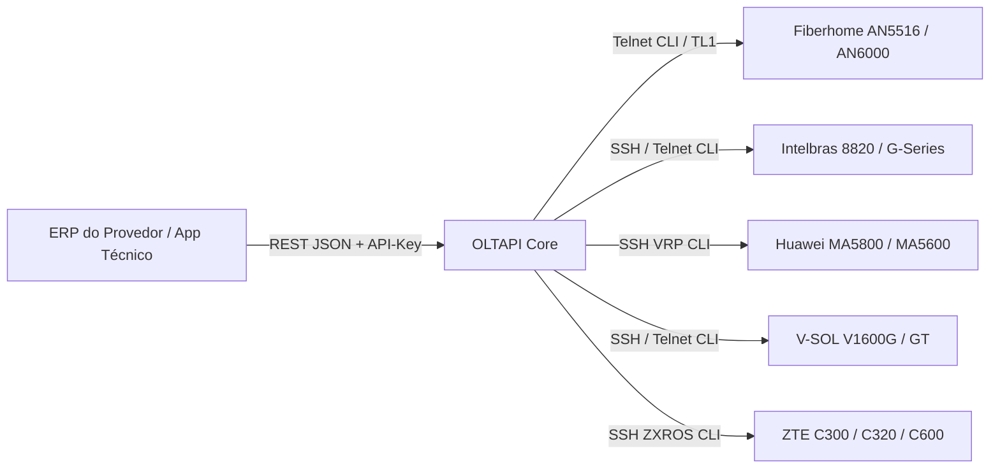

# 🌐 OLTAPI - Documentação Oficial

**API REST Unificada, Agnóstica e Aberta para Provisionamento, Telemetria Óptica e Disaster Recovery Multi-OLT**

---

## 🎯 Visão Geral

O **OLTAPI** foi concebido para resolver um dos gargalos mais críticos enfrentados por Provedores de Internet (ISPs): a **heterogeneidade das redes ópticas**. Cada fabricante de OLT (Fiberhome, Intelbras, Huawei, V-SOL, ZTE) adota dialetos de terminal (CLI) distintos, formatos proprietários e particularidades operacionais.

O OLTAPI atua como uma **camada de abstração de alta performance**, permitindo que ERPs de telecomunicações (IXC, MK-Auth, SGP, Voalle, etc.), sistemas de auto-atendimento ou técnicos de campo executem operações completas através de um **único contrato JSON padronizado**.

---

## 🚀 Principais Capacidades

* 🟢 **Concentrador 100% Homologado em Campo:** Driver Fiberhome AN5516 validado com tráfego real em bancada nos modos **Router (PPPoE oficial)**, **Bridge** e **VEIP (para ONUs de terceiros como Huawei/ZTE)**.
* ⚡ **Onboarding Zero-Touch:** Detecção automática de protocolo (SSH / Telnet), fingerprint de fabricante e modelo, backup Baseline v0 e ingestão de inventário em segundos.
* 📊 **Telemetria Óptica Dupla:** Leitura em tempo real de **ONU RX** (potência recebida pelo cliente) e **OLT RX** (potência recebida na porta PON da OLT).
* 🔄 **Auto-Recuperação Reativa (Broadband Forum TR-101):** Rastreamento perpétuo de hardware vinculado ao contrato comercial do ERP, resolvendo fusões invertidas e cutovers com desprovisionamento da posição fantasma e recálculo dinâmico do Circuit ID.
* 💾 **Disaster Recovery & Detecção de Drift:** Coleta automatizada com upload FTP remoto, cálculo de hash criptográfico SHA-256, comparador de unified diff (estilo git) e auditoria de integridade.
* 🔔 **Webhooks Criptografados (HMAC SHA-256):** Notificações push assíncronas para sincronização em tempo real de eventos de rede com ERPs.
* 🛡️ **Segurança em Primeiro Lugar:** Prevenção ativa contra injeção de comandos de terminal em todos os parâmetros, autenticação em tempo constante e criptografia AES-256 de credenciais em repouso.

---

## 🗺️ Navegação Rápida

Explore as seções da documentação:

::: cards
- [🐳 **Guia de Instalação**](instalacao.md)  
  Como inicializar a stack de produção com Docker Compose e PostgreSQL 16.
- [📡 **Manual Operacional (ERPs)**](MANUAL_OPERACIONAL.md)  
  Exemplos práticos de chamadas via cURL, Python, PHP e Node.js para integrar com seu sistema.
- [🛠️ **Manual do Desenvolvedor**](MANUAL_DESENVOLVEDOR.md)  
  Como a arquitetura de drivers funciona por dentro e como adicionar novos fabricantes.
- [📖 **Referência da API (ReDoc)**](referencia-api.md)  
  Especificação interativa e detalhada de todos os 66 endpoints da API REST.
:::
