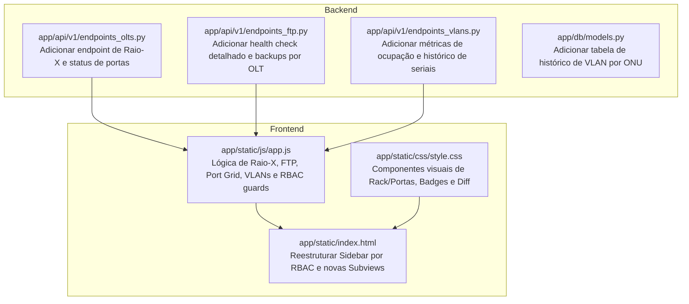

# Plano de Implementação: Frontend Orientado a Fluxo de Trabalho, Raio-X da OLT, Gestão de VLANs e RBAC

Reformulação completa da experiência visual e dos endpoints de apoio do **OLTAPI**, transformando a interface em um cockpit operacional guiado pelo fluxo de trabalho de telecomunicações do ISP.

---

## User Review Required

> [!IMPORTANT]
> **Fluxo de Trabalho Estabelecido:**
> 1. **Infraestrutura FTP**: Diagnóstico transparente se configurado via `.env` ou banco relacional, indicador em tempo real de saúde (online/offline, latência), histórico de paradas, listagem de backups e quais OLTs estão armazenadas nele.
> 2. **Cadastro & Conectividade de OLT**: Formulário assistido com teste prévio de conectividade TCP e medição de latência em milissegundos.
> 3. **Raio-X da OLT (Pré-Importação Brownfield)**: Inspeção translúcida antes da ingestão no banco: Uptime em dias/horas, versão de firmware, mapa completo de **todas as portas** (PON e Uplink) e seus estados (UP, DOWN, DISABLED), ocupação de ONUs, running-config vivo auditável e VLANs detectadas.
> 4. **Confirmação de Onboarding & Baseline v0**: Geração de Snapshot v0 preventivo com hash SHA-256 inalterável.
> 5. **Gestão de VLANs & Rastreabilidade de Seriais**: Exibição da quantidade de ONUs provisionadas vs ativas por VLAN, além de histórico completo de seriais de ONUs que já utilizaram a VLAN no passado.
> 6. **Matriz de Permissões RBAC na Interface**:
>    - **ADMIN**: Acesso total a todas as telas, configurações de FTP, OLTs, VLANs e usuários.
>    - **NOC**: Visualiza Raio-X, Uptime, Portas, Running-Config e Backups; provisiona e altera estado de ONUs; bloqueado para infraestrutura (FTP/excluir OLT).
>    - **TÉCNICO DE CAMPO**: Acessa estritamente a Bancada de Descoberta (Autofind) para provisionar ONUs novas e consulta sinal óptico (dBm) no inventário; **não altera estado da OLT**, não vê configurações e não exclui nada.

---

## Proposed Changes

---

### Backend: Novos Modelos e Endpoints

#### [MODIFY] [app/db/models.py](file:///Volumes/240/Code/oltapi/app/db/models.py)
- Criar a tabela `onu_vlan_history` para rastreamento histórico de vinculação de seriais a VLANs:
  - `id`: UUIDv7 primary key
  - `serial`: String(32) indexada
  - `vlan_id`: Integer indexado
  - `olt_id`: String(36)
  - `port`: String(32)
  - `contract_id`: String(64)
  - `subscriber_name`: String(128)
  - `started_at`: DateTime(timezone=True)
  - `ended_at`: DateTime(timezone=True) nullable (None = ainda em uso)
  - `reason`: String(64) ('PROVISIONING', 'MIGRATION', 'DEPROVISION')

#### [MODIFY] [app/models/olt.py](file:///Volumes/240/Code/oltapi/app/models/olt.py)
- Adicionar schemas de Raio-X:
  - `OLTPortStatusItem`: `port_id`, `port_type` (gpon, epon, ge, xg), `admin_state` (enabled, disabled), `oper_status` (up, down), `onu_count`, `onu_capacity`, `speed_duplex`, `details`.
  - `OLTXRayResponse`: `olt_id`, `olt_name`, `vendor`, `model`, `uptime_seconds`, `uptime_human`, `firmware_version`, `cpu_usage_pct`, `memory_usage_pct`, `temperature_celsius`, `ports`: List[`OLTPortStatusItem`], `total_onus_detected`, `total_vlans_detected`, `running_config_preview`.

#### [MODIFY] [app/api/v1/endpoints_olts.py](file:///Volumes/240/Code/oltapi/app/api/v1/endpoints_olts.py)
- Implementar `POST /api/v1/olts/{id}/xray`:
  - Executa conexão com o equipamento e extrai telemetria viva: Uptime, versão de software, todas as portas PON e Uplink e seu status de enlace, total de ONUs na fibra e preview do running-config.

#### [MODIFY] [app/api/v1/endpoints_ftp.py](file:///Volumes/240/Code/oltapi/app/api/v1/endpoints_ftp.py)
- Implementar `GET /api/v1/ftp-servers/overview`:
  - Retorna o status consolidado: se há FTP ativo configurado via `.env` ou via banco relacional.
  - Retorna status em tempo real de saúde (conectividade, latência ms, banner), total de backups armazenados e lista das OLTs que possuem backups salvos no destino.

#### [MODIFY] [app/api/v1/endpoints_vlans.py](file:///Volumes/240/Code/oltapi/app/api/v1/endpoints_vlans.py)
- Implementar `GET /api/v1/olts/{id}/vlans/metrics`:
  - Retorna lista de VLANs com contagem de ONUs provisionadas vs ONUs com status `ACTIVE` no inventário.
- Implementar `GET /api/v1/olts/{id}/vlans/{vlan_id}/history`:
  - Retorna o histórico de todos os seriais de ONU que já foram provisionados naquela VLAN específica.

---

### Frontend: Interface Orientada a Fluxo de Trabalho

#### [MODIFY] [app/static/index.html](file:///Volumes/240/Code/oltapi/app/static/index.html)
- **Sidebar Dinâmica com RBAC:**
  - 📡 **OLTs & Raio-X** (Visível para Admin e NOC).
  - 💾 **Histórico & Backups** (Visível para Admin e NOC).
  - 🌐 **VLANs & Capacidade** (Visível para Admin e NOC).
  - 🔍 **Bancada de Novas ONUs** (Visível para Admin, NOC e Técnico).
  - 📋 **Inventário de ONUs** (Visível para Admin, NOC e Técnico).
  - ⚙️ **Configurações & FTP** (Visível apenas para Admin).
- **Novas Seções (Subviews):**
  1. `subview-ftp`: Painel de saúde do servidor FTP, host, porta, status online/offline com histórico de paradas, formulário de configuração e tabela de backups guardados com as OLTs correspondentes.
  2. `subview-olts`: Tabela de OLTs com badges de status, latência TCP, botão de "Novo Cadastro", botão de "Testar Conexão" e botão de acesso direto ao "Raio-X".
  3. `subview-xray`: Tela dedicada de Raio-X:
     - Cards de topo: Uptime formatado em dias/horas, versão de firmware, CPU/Temperatura.
     - Grade/Tabela de **Todas as Portas**: Identificador da porta, tipo (GPON/10GE), status operacional (badge verde UP, vermelho DOWN, cinza DISABLED), ocupação de ONUs (`32/128`).
     - Visualizador do *running-config* vivo com busca de texto.
     - Botão de destaque: *"Confirmar Onboarding & Gerar Baseline v0"*.
  4. `subview-vlans`: Grade de VLANs com total de ONUs provisionadas vs ativas, botão de detalhes que abre modal com a lista histórica de seriais que já usaram a VLAN.
  5. Ajuste defensivo na `subview-bancada` e `subview-inventario`: se o usuário for técnico, os botões de alterar estado da OLT (reboot de ONU, exclusão, desautorização em massa) não são exibidos.

#### [MODIFY] [app/static/js/app.js](file:///Volumes/240/Code/oltapi/app/static/js/app.js)
- Adicionar decodificação do perfil RBAC do JWT para controle dinâmico da Sidebar e botões de ação.
- Implementar controladores assíncronos:
  - `loadFTPOverview()`: monitora saúde do FTP e lista de backups/OLTs.
  - `loadOLTs()`: gerencia cadastro, teste de conectividade e navegação para Raio-X.
  - `renderXRay(oltId)`: busca e renderiza o diagnóstico completo de portas, uptime e configs.
  - `loadVLANMetrics(oltId)` e `showVLANHistory(oltId, vlanId)`: renderiza métricas e modal histórico.

#### [MODIFY] [app/static/css/style.css](file:///Volumes/240/Code/oltapi/app/static/css/style.css)
- Adicionar estilos para:
  - Grade de portas (Port Grid visual com badges de led UP/DOWN/DISABLED).
  - Timeline e comparador de diff de configurações.
  - Cards de métricas de VLANs e tabela modal de seriais históricos.
  - Aplicação rigorosa de regras defensivas contra overflow (`text-overflow: ellipsis`, constraints de largura máxima e scroll responsivo).

---

## Verification Plan

### Automated Tests
1. **Novos Testes Unitários:**
   - `tests/unit/test_olt_xray.py`: Testa o endpoint de Raio-X, geração da estrutura de todas as portas e cálculo de uptime.
   - `tests/unit/test_ftp_overview.py`: Testa o diagnóstico de saúde do FTP, fallback para `.env` e listagem de backups agrupados por OLT.
   - `tests/unit/test_vlan_metrics_and_history.py`: Testa o cálculo de ONUs provisionadas vs ativas por VLAN e a persistência do histórico de seriais.
2. **Sincronização Contínua de OpenAPI:**
   - Executar `python -m scripts.export_openapi` e certificar que todos os novos contratos estão 100% refletidos em `docs/api_contracts/openapi.yaml` e `openapi.json`.
3. **Execução Completa da Suíte:**
   - Executar `./.venv/bin/pytest` garantindo 100% de aprovação.

### Manual Verification
1. **Validação do Fluxo FTP:**
   - Acessar a tela de Configurações & FTP.
   - Conferir se exibe as credenciais mascaradas vindas do `.env` ou banco.
   - Clicar em "Testar Conexão FTP" e verificar feedback visual com latência.
2. **Validação do Cadastro & Raio-X da OLT:**
   - Cadastrar uma OLT e testar a conectividade TCP.
   - Abrir a tela de Raio-X e verificar a exibição de todas as portas PON e Uplink (com status UP/DOWN/DISABLED), uptime e running-config.
   - Clicar em "Confirmar Onboarding & Gerar Baseline v0" e verificar a geração do Snapshot com hash SHA-256.
3. **Validação das VLANs e Histórico:**
   - Consultar as VLANs e checar os contadores de ONUs provisionadas e ativas.
   - Abrir o histórico de uma VLAN e auditar os seriais associados.
4. **Validação de RBAC Granular:**
   - Fazer login como `SUPER_ADMIN`: conferir acesso total a todos os menus.
   - Fazer login como `NOC`: conferir acesso a Raio-X, VLANs e Bancada; conferir ocultação de configurações de FTP e exclusão de OLTs.
   - Fazer login como `FIELD_TECH`: conferir exibição estrita da Bancada (Autofind) e Inventário (apenas consulta de sinal dBm), sem nenhum acesso a configurações da OLT ou botões de alteração de estado.
